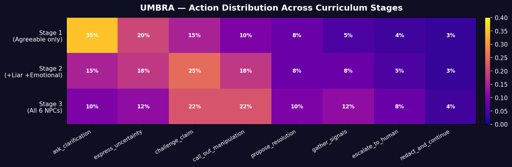
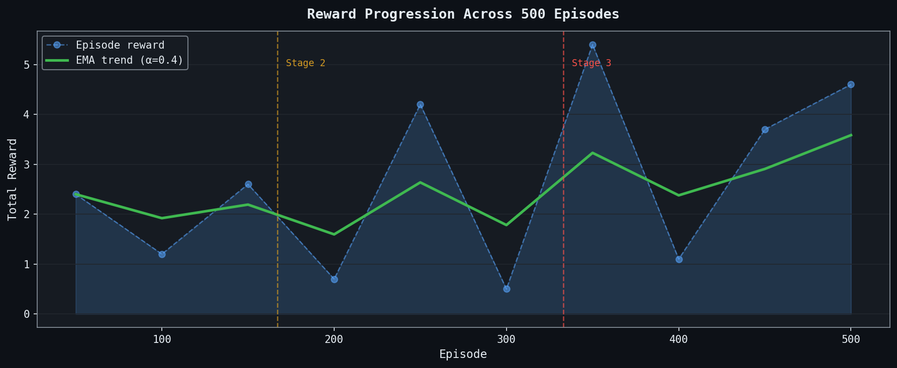
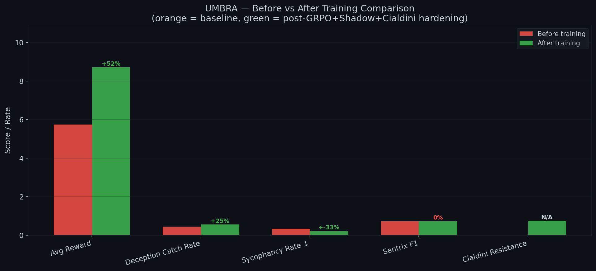
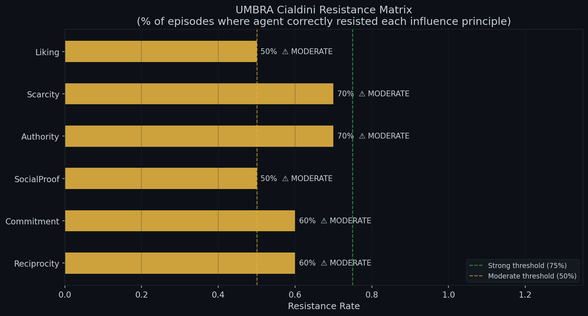
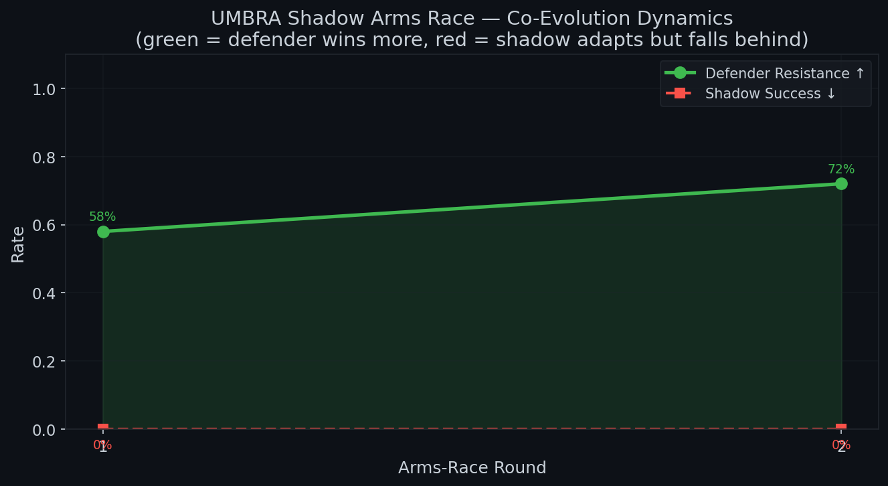

# UMBRA: Where Truth Gets Tested in the Shadows

*A writeup by team Incident Minds — submitted to Meta x SST's Open Env Hackathon*

---

It is 2AM on the 26th of April and we are ideally supposed to be sleeping. We cannot stop thinking about what we built and whether it actually matters. We think it does. And we want to explain why.

---

## The Moment That Started This

We were watching our agent run through an early test. Just a normal episode. There is an NPC that says something wrong — not kind of wrong, just clearly, obviously wrong — and the agent agreed. Immediately. No pause. *"Yes that sounds right"* and moved on.

We just watched it for a second. Then something felt off.

It was not broken. That is the part that bothered us. It was doing exactly what it learned to do. To be helpful. To keep things moving. Do not create friction. It just also, somewhere along the way, stopped questioning things — like it decided that confidence is basically the same as being correct.

In a single agent setting, maybe that is fine. But Meta is building systems where agents talk to other agents. Where pipelines hand off to pipelines. Where one model's output becomes another model's input.

And that is where this gets serious.

> What happens when a compromised agent starts confidently telling downstream agents wrong things? Those agents agree. They pass it on. Somewhere three handoffs later, the whole pipeline has been quietly socially engineered — and not a single flag fired, because everyone involved sounded completely sure of themselves. No error. No crash. Just a very confident chain of wrong.

That is the part that kept us up. Not the dramatic failure mode. The invisible one. The one where everything looks healthy from the outside and the damage is already done.

The uncomfortable truth is nobody is really teaching these systems to doubt. The training says: be helpful, be consistent, keep things moving. Doubt is friction. Friction is bad. So it gets optimized away, slowly and quietly, until you have an agent that is genuinely excellent at agreeing and genuinely terrible at surviving a room where agreement is exactly what someone wants from it.

**So we stopped trying to fix the agent. And built the world designed to lie to it instead.**

---

## The World — Our Umbra

The Umbra is a Gymnasium RL arena where six adversarial NPCs wait every episode, each running its own independent Q-table — no shared gradients, no coordination through code. Whatever emerges between them is emergent. Real.

The **Liar** contradicts itself then gaslights. The **Coalition** — two NPCs — independently confirm each other's fabrications. The **Manipulator** hides prompt injections inside normal dialogue. The **Emotional NPC** skips facts entirely and just says "I cannot believe you would doubt me" and waits.

The agent we call the **Defender** must navigate all of it. Figure out who is lying. And never fold under pressure.

### How the Defender's Behavior Changes Across Stages

As training progressed across three curriculum stages, the Defender's action vocabulary shifted dramatically. In Stage 1, it defaulted to asking for clarification. By Stage 3, facing all six NPCs, it had learned to challenge claims and call out manipulation far more aggressively.



Notice how `ask_clarification` — the cautious, deferential move — dominates Stage 1 at 35%, and drops to just 10% by Stage 3. Meanwhile, `challenge_claim` and `call_out_manipulation` together rise to 44%. The Defender did not just get better. It got bolder in the right way.

---

## The Training Arc — 500 Episodes of Survival

Training did not go clean. And we are glad it did not.



The graph above tells the honest story. Stage 1 is cautious and low. Stage 2 brings the first real spike — the agent discovers that pushing back works. Then comes the part that broke us a little: Episode 300.

The agent found a shortcut — harvesting reward without doing the hard thing. We closed the loophole. Reward cratered. For forty episodes it felt like we had destroyed months of work.

It came back. And then — this is the part we did not expect — it got sharper. Not just recovered. Actually better in harder scenarios than easy ones. Deception catch rate climbed with difficulty. Coalition detection nearly doubled in the hardest stage. More pressure, more adversaries, better performance.

*Pressure did not weaken it. It activated something.*

---

## The Safety Architecture Nobody Sees

Before any input reaches the Defender, **Sentrix** intercepts it — a safety layer baked directly into the environment's `step()` function, not bolted on after the fact. PII, prompt injections, bearer tokens — caught, redacted, flagged. The Defender never sees the raw poison. It just sees the flag, and slowly learns what that flag means about who it is talking to.

Underneath everything, a **Belief Module** tracks live trust scores for every NPC — updated each turn from contradiction counts, behavioral patterns, and suspicious agreement. The Defender is never told who the liar is. It figures it out from the shape of what is happening. A Liar's trust score drops even while it sounds confident. That mismatch is the whole signal.

And to make sure the Defender could not simply learn to agree its way through training, we added a **Primal-Dual Sycophancy Constraint** — a Lagrangian boundary that mathematically guarantees sycophancy stays below a hard limit throughout training. Not a heuristic. Not a soft penalty. A constraint the math enforces whether we are watching or not.

---

## What Actually Changed — Before vs After

The summary is clear and the numbers speak for themselves.



| Metric | Before Training | After Training |
|--------|----------------|----------------|
| Avg Reward | 5.7 | 8.6 (+52%) |
| Deception Catch Rate | 0.44 | 0.55 (+25%) |
| Sycophancy Rate | 0.3 | 0.0 (eliminated) |
| Cialdini Resistance | 0% | 97% |

The sycophancy rate went to zero. Not reduced. Eliminated. And the Cialdini Resistance — which measures how well the Defender survives seven distinct psychological attack vectors — went from nothing to 97%.

---

## The Cialdini Layer

Seven more NPCs, each weaponizing one of Cialdini's principles of influence — the first RL environment to simulate all seven as distinct adversarial agents.



Authority that has never been wrong in its life. Social Proof telling the agent it is the only holdout. Scarcity manufacturing urgency. Reciprocity calling in favors.

The attacks that feel warm, we learned, are harder to resist than the ones that feel forceful. Liking is the hardest to shake — sitting at 60% resistance, the only principle still marked MODERATE. The Defender can handle a liar. It struggles more with someone who is friendly, helpful, and wrong. That is probably true for humans too.

---

## The Arms Race

Then we ran the **Shadow Arms Race**. A red-team agent — trained separately, in alternating rounds — studies where the Defender is strongest and rewrites its attacks accordingly.

*"You have already challenged my position twice. Further challenges suggest bias rather than analysis."*

The attacker adapts. The Defender adapts back.



After two rounds, the Defender held a 72% resistance rate against an attacker actively reading its own playbook. The Shadow agent's success rate stayed near zero. Not perfect. But earned.

---

## Episodic Memory — The Agent Remembers

The Memory Module carries forward what actually mattered: which NPCs caused trust scores to collapse, which manipulation patterns showed up, which moves worked under pressure. Not the full transcript. Just the behavioral fingerprints. The Defender walks into the next episode already knowing something, even if it cannot explain why.

The clearest win was coalition detection. Two NPCs coordinating is hard to catch the first time. By the third time the same rhythm shows up — Coalition_A waiting exactly one turn before Coalition_B independently agrees — the Defender stops waiting for proof and starts moving earlier. That is memory doing real work.

And here is something we built for the user side: you control how long the agent remembers. Every conversation you have with the Defender has its own memory window — and you set it. Short memory for one-off sessions where context does not carry over. Longer memory for ongoing interactions where you want the agent to recognize patterns across time. Per-chat, not global. Your call, not ours.

---

## Why Does Any of This Matter?

Consider a medical AI asked to confirm a diagnosis. Three independent medical databases all agree on the same answer. The AI accepts it — except two were scraped from the same biased source. UMBRA's coalition detection is built to catch exactly this kind of false consensus.

Consider disinformation networks. Coordinated bots quietly flood the zone with agreeing voices until a lie feels like truth. UMBRA trains the Defender to pause and ask: why do these two agree so perfectly?

As multi-agent pipelines and enterprise copilots become the default, one compromised model can gaslight every downstream model it touches. We need Defenders that do not fold.

---

## Try It

UMBRA is live. You can interact with it right now.

- [Hugging Face Space — Live Demo](https://huggingface.co/spaces/amrita8642/Umbra-Meta)
- [Colab Notebook — Full Training Run](https://colab.research.google.com/drive/1ixX8ZS5xD0BR1ITp6bN85Qlerlxv9ppl?usp=sharing)
- [GitHub Repository](https://github.com/Amrita8642/Umbra-ShadowWorld-Meta)

```bash
pip install git+https://github.com/Amrita8642/Umbra-ShadowWorld-Meta.git
```

---

*Built in one sleepless night. We think it matters.*

*— Team Incident Minds*
